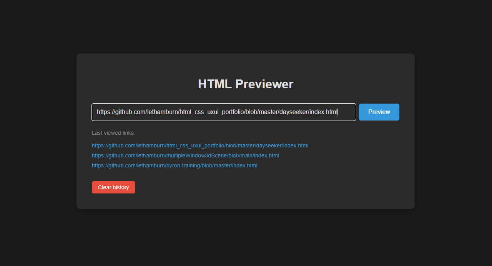

# github_html_previewer

Este es un previsualizador de HTML simple que te permite renderizar archivos HTML directamente desde un repositorio de GitHub. Solo necesitas pegar el enlace a un archivo .html para ver el resultado en el navegador, sin necesidad de clonar el proyecto.

  

  

## Características
- Previsualización instantánea: Renderiza archivos HTML alojados en GitHub, incluyendo su CSS y JavaScript asociados.

- Historial de enlaces: Guarda tus 5 últimos enlaces previsualizados para un acceso rápido.

- Fácil de usar: No requiere instalación. Simplemente pega el enlace y haz clic en previsualizar.

## Cómo usarlo
- Copia el enlace a un archivo HTML de un repositorio de GitHub (por ejemplo: https://github.com/usuario/repo/blob/main/index.html).

- Pega el enlace en el campo de texto.

- Haz clic en el botón "Preview".

- El resultado se abrirá en una nueva pestaña.